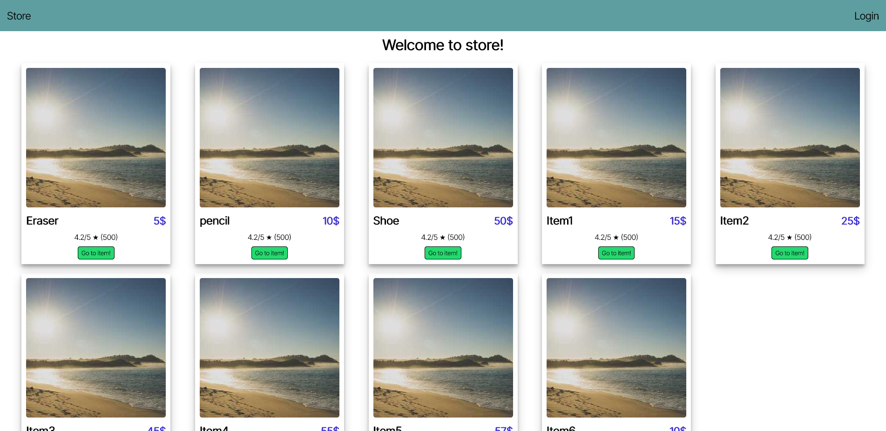

# Changelog 1.1

- Cart is running
- Added cart items cannot buyable

# Changelog 1.0

- Login works
- Bookmarks works
- Bookmarks fetched at login
- 1 is admin, 2 and 3 is user.

## Optimization problem

- Fetch user and products once with custom hook. Fetching multiple times makes program run slow.
- Export "type"s globally and reuse them.

# TODO:

- Search in store
- Visualize cart
